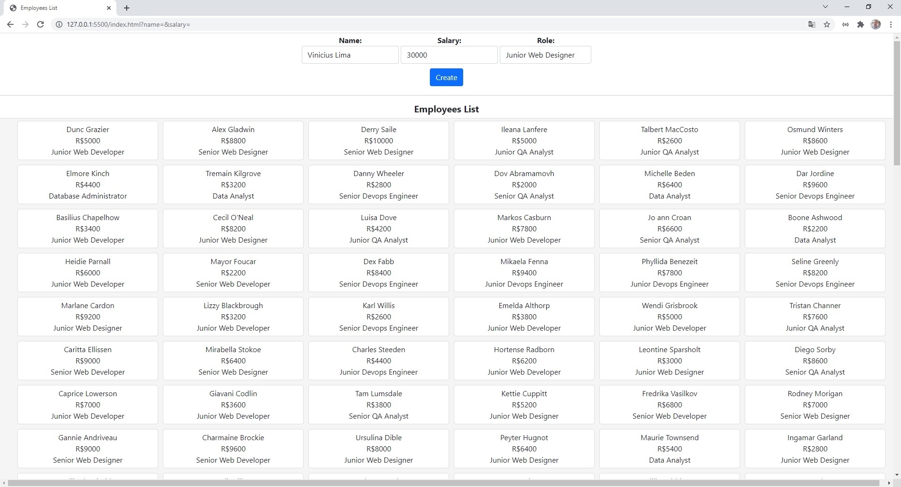

<h1 align="center">
     Employees List 
</h1>

  <a href="#-project">Project</a>&nbsp;&nbsp;&nbsp;|&nbsp;&nbsp;&nbsp;
  <a href="#-technologies">Technologies</a>&nbsp;&nbsp;&nbsp;|&nbsp;&nbsp;&nbsp;
  <a href="#-how-to-run">How to Run</a>&nbsp;&nbsp;&nbsp;|&nbsp;&nbsp;&nbsp;

## 💻 Project

Simple CRUD about Employees List.

 

## 🛠️ Technologies

This project was developed with the following technologies:

- **Backend**
  - JSON SERVER

- **Frontend**
  - HTML
  - CSS
  

## ⚙️ How To Run

Follow this steps below to run this project

- Clone o repository with `git clone https://github.com/viniciuslimax10/employees-list`;
- **Backend:**
  - Install the JSON SERVER with `npm install -g json-server`
  - Go to directory database with `cd database`;
  - Run the server with `json-server --watch db.json`
- **Frontend:**
  - Just open the file `index.js` ;

 

